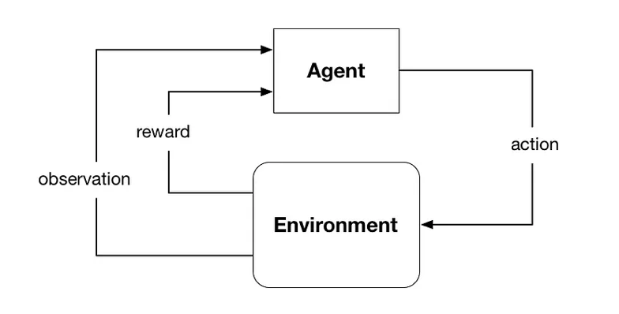
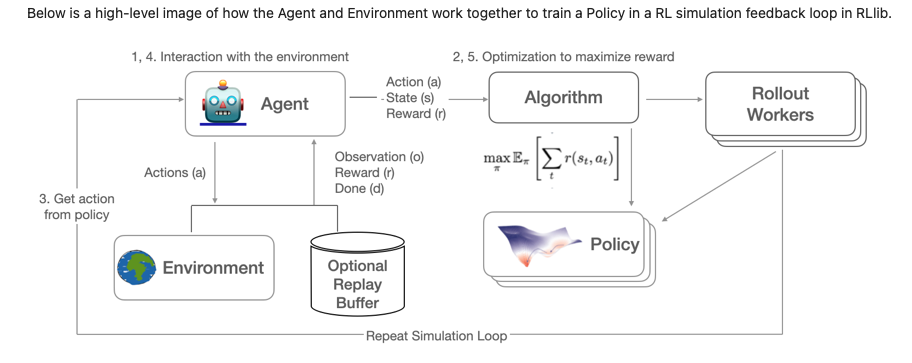

# Ray RL
 Reinforcement Learning on Ray.io

## Intro
 RLlib is an open-source library for reinforcement learning (RL), offering support for production-level, highly distributed RL workloads while maintaining unified and simple APIs for a large variety of industry applications.

## What is Reinforcement Learning

 With reinforcement learning, one or more agents interact within an environment which may be either a simulation or a connection to real-world sensors and actuators.

 At each step, the agent receives an observation (i.e., the state of the environment), takes an action, and receives a reward. Agents learn from repeated trials, and a sequence of those is called an episode — the sequence of actions from an initial observation up to either a “success” or “failure” causing the environment to reach its “done” state. 

 The learning portion of an RL framework trains a policy about which actions (i.e., sequential decisions) cause agents to maximize their long-term, cumulative rewards. 

 Many RL use cases involve control systems, where policies determine sequential decisions over time: competing in video games, managing a financial portfolio, robotics, self-driving cars, factory automation, and so on.

 

## Overview of RL terminology

An RL environment consists of:

1. **action space** - all possible actions
2. **state space** - a complete description of the environment, nothing hidden 
3. **observation space** an observation by the agent of certain parts of the state 
4. **reward** - is the only feedback the agent receives after each action.

The model that tries to maximize the expected sum over all future rewards is called a policy. The policy is a function mapping the environment's observations to an action to take, usually written π (s(t)) -> a(t). In deep reinforcement learning, this function is a neural network.

> In RL, a model is roughly equivalent to a policy, but policy is more specific because it is trained in a specific environment. For deployment, we use the word "model" because more people understand the ML meaning of a trained model.

 

## Helpful Ray RL Links

[RLlib: Industry-Grade Reinforcement Learning](https://docs.ray.io/en/latest/rllib/index.html)

[Ray RL Examples](https://docs.ray.io/en/latest/rllib/rllib-examples.html)

[Intro to RLlib: Example Environments](https://medium.com/distributed-computing-with-ray/intro-to-rllib-example-environments-3a113f532c70)

[Reinforcement Learning with RLlib in the Unity Game Engine](https://medium.com/distributed-computing-with-ray/reinforcement-learning-with-rllib-in-the-unity-game-engine-1a98080a7c0d)

[Lessons from Implementing 12 Deep RL Algorithms in TF and PyTorch](https://medium.com/distributed-computing-with-ray/lessons-from-implementing-12-deep-rl-algorithms-in-tf-and-pytorch-1b412009297d)

[Proximal Policy Optimization Algorithms](https://arxiv.org/abs/1707.06347)

[Ray Rl Example - Learning to Play Pong](https://docs.ray.io/en/latest/ray-core/examples/plot_pong_example.html)

[Deep Reinforcement Learning: Pong from Pixels](http://karpathy.github.io/2016/05/31/rl/)