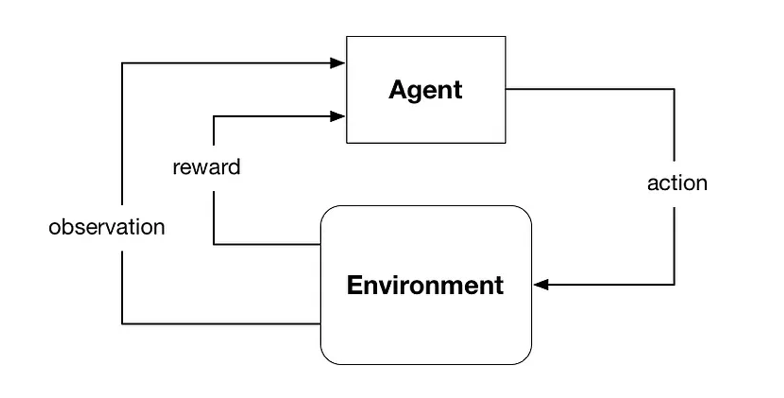
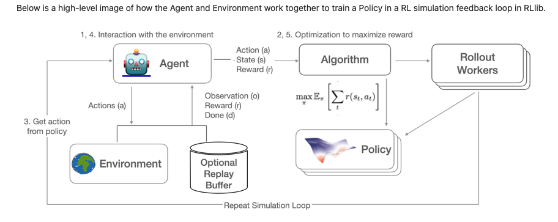

# Cloudera Blueprint: Ray RLlib Quickstart

> Reinforcement learning with [Ray RLlib](https://docs.ray.io/en/latest/rllib/index.html) on Cloudera AI — concepts, a modern PPO notebook, and a runnable script on Gymnasium `Taxi-v3`. Catalog fields live in [`METADATA.yaml`](METADATA.yaml).

## Table of Contents

- [Overview](#overview)
- [Demo](#demo)
- [Use Case](#use-case)
- [Key Features](#key-features)
- [Quickstart](#quickstart)
- [Architecture](#architecture)
- [Target Audience](#target-audience)
- [Repository Structure](#repository-structure)
- [Prerequisites](#prerequisites)
- [Hardware Requirements](#hardware-requirements)
- [Documentation](#documentation)

## Overview

This blueprint teaches distributed reinforcement learning with **Ray RLlib** and shows how to run a current-API PPO loop on Cloudera AI Workbench (or any Python 3.10–3.12 environment). It combines a short RL primer with a working Taxi-v3 training example so teams can go from vocabulary to a first successful `algo.train()` / `algo.evaluate()` run in minutes.

## Demo

Walk through the notebook [`RayRLTest.ipynb`](RayRLTest.ipynb) or run the equivalent script:

```bash
python train_taxi_ppo.py
```

Expected signal after five short iterations: mean episode return improves (still negative on Taxi-v3 for a tiny run), then a final `evaluate` line prints. A recorded Reprise walkthrough can be linked here when available (`reprise_link` in [`METADATA.yaml`](METADATA.yaml)).

## Use Case

Teams adopting RL often struggle to connect textbook terms (observation, reward, policy) to a modern, distributed training stack. This blueprint closes that gap: explain the loop, then train **Proximal Policy Optimization (PPO)** on the classic Taxi domain using RLlib’s EnvRunner / RLModule API. Primary outcome — a reproducible first success path for RL experimentation on Cloudera AI that can grow into larger Gymnasium or custom environments.

## Key Features

- Modern RLlib API stack (`env_runners`, `FlattenObservations`, `DefaultModelConfig`, `build_algo()`)
- Runnable script and Jupyter notebook with the same training loop
- Pinned dependencies (`ray[rllib]`, PyTorch, Gymnasium) for reproducible local or Workbench sessions
- Concise RL terminology and diagrams for onboarding non-RL practitioners
- Catalog-ready [`METADATA.yaml`](METADATA.yaml) for Cloudera blueprint listing

## Quickstart

1. Clone the repository.
2. Create and activate a virtual environment (Python **3.10–3.12**):

   ```bash
   python -m venv .venv
   source .venv/bin/activate   # Windows: .venv\Scripts\activate
   pip install -r requirements.txt
   ```

3. Train PPO on Taxi-v3:

   ```bash
   python train_taxi_ppo.py
   ```

4. Or open [`RayRLTest.ipynb`](RayRLTest.ipynb) with the venv kernel selected and run all cells.

**On Cloudera AI Workbench / CML:** create a Python session or notebook runtime, upload or clone this repo, install from `requirements.txt`, then run the script or notebook.

Apple Silicon: see [Ray install notes for M-series Macs](https://docs.ray.io/en/latest/ray-overview/installation.html#m1-mac-apple-silicon-support) if the default wheel fails.

What the example does:

1. Configure **PPO** on `Taxi-v3` with two EnvRunners
2. Flatten discrete Taxi observations with `FlattenObservations`
3. Train for five iterations, evaluate, then `algo.stop()`

## Architecture

```text
Developer / Workbench session
        │
        ▼
┌───────────────────┐     sample      ┌────────────────────┐
│  PPO Algorithm    │◄───────────────►│ EnvRunners (×2)    │
│  + RLModule MLP   │                 │ Gymnasium Taxi-v3  │
│  (Torch)          │                 │ FlattenObservations│
└─────────┬─────────┘                 └────────────────────┘
          │ evaluate()
          ▼
┌───────────────────┐
│ Eval EnvRunner    │
└───────────────────┘
```

| Component | Role |
| --- | --- |
| Ray RLlib PPO | On-policy trainer (`PPOConfig` → `build_algo()`) |
| EnvRunners | Parallel environment sampling |
| `FlattenObservations` | One-hot discrete Taxi observations for the MLP |
| PyTorch RLModule | Default policy/value network (`fcnet_hiddens=[64, 64]`) |
| Cloudera AI Workbench | Host for notebook/session execution |

RL loop reminder:





## Target Audience

- ML engineers exploring reinforcement learning on Cloudera AI
- Solution architects evaluating Ray RLlib for control / sequential decision use cases
- Data scientists who know supervised ML and need a first distributed RL path

## Repository Structure

| Path | Description |
| --- | --- |
| `METADATA.yaml` | Catalog metadata for the Cloudera blueprint website |
| `README.md` | Blueprint overview, quickstart, and architecture |
| `requirements.txt` | Pinned Ray RLlib / Torch / Gymnasium |
| `train_taxi_ppo.py` | Runnable PPO → Taxi-v3 script |
| `RayRLTest.ipynb` | Same example as a notebook |
| `images/` | Diagrams (RL overview and policy) |
| `LICENSE` | Unlicense (public domain dedication) |

## Prerequisites

- Python **3.10–3.12**
- `pip` and git
- Dependencies in [`requirements.txt`](requirements.txt): `ray[rllib]==2.56.1`, PyTorch, Gymnasium
- Optional: Cloudera AI Workbench / CML session with outbound package install access
- Optional: Jupyter / VS Code / Cursor for the notebook

## Hardware Requirements

| Deployment | Minimum |
| --- | --- |
| Local / Workbench demo | 2+ CPU cores, 8 GB RAM, ~5 GB disk for deps |
| Longer training / larger envs | 4+ CPUs, 16 GB RAM; GPU optional (Torch CUDA) |

The included Taxi-v3 smoke test completes in under a minute on a laptop CPU.

## Documentation

### RL terminology (primer)

An RL environment consists of:

1. **Action space** — all possible actions
2. **State space** — a complete description of the environment (nothing hidden)
3. **Observation space** — what the agent actually sees from the state
4. **Reward** — the only feedback the agent receives after each action

The model that tries to maximize the expected sum of future rewards is a **policy**. It maps observations to actions, usually written π(s(t)) → a(t). In deep RL, that function is a neural network.

> In RL, “model” is roughly equivalent to “policy,” but policy is more specific because it is trained in a particular environment. For deployment, people often say “model” in the usual ML sense.

### External links

- [RLlib docs](https://docs.ray.io/en/latest/rllib/index.html)
- [RLlib examples](https://docs.ray.io/en/latest/rllib/rllib-examples.html)
- [Intro to RLlib: example environments](https://medium.com/distributed-computing-with-ray/intro-to-rllib-example-environments-3a113f532c70)
- [Proximal Policy Optimization (paper)](https://arxiv.org/abs/1707.06347)
- [Deep RL: Pong from pixels](http://karpathy.github.io/2016/05/31/rl/)
- [Cloudera AI documentation](https://docs.cloudera.com/)

## License

[Unlicense](LICENSE) — public domain dedication.
